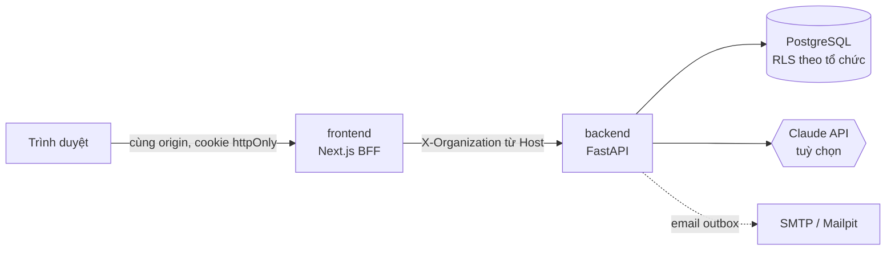

<div align="center">

# Talent Hub

**Hệ điều hành "từ tuyển chọn đến kết quả" cho các chương trình đào tạo nhân tài theo đợt.**

AI đọc hồ sơ có dẫn chứng kiểm chứng được · con người quyết định · hệ thống tự học từ kết quả để chọn tốt hơn ở khoá sau.

[](https://github.com/Tai-TZ/talent-hub/actions/workflows/ci.yml)


</div>

---

## Tổng quan

Khách hàng đầu tiên là **Northwind University** với chương trình *nhân tài AI thực chiến* (khoá 12 tuần theo mô hình 3+3+6, ba nhánh chuyên sâu, thực chiến tại doanh nghiệp đối tác). Nền tảng được thiết kế **đa tổ chức** để các trường khác dùng lại bằng cấu hình, không cần sửa mã.

### Vấn đề

Chương trình chạy nhiều khoá liên tiếp, mỗi khoá chọn khoảng 500 học viên từ hàng nghìn hồ sơ. Bảng tính và CRM tuyển sinh thông thường không giải quyết được bốn việc:

| Nỗi đau | Cách Talent Hub xử lý |
|---|---|
| Đọc hàng nghìn hồ sơ trong vài ngày, chấm lệch nhau, dễ bị "neo" bởi điểm người khác | **Sàng lọc AI có dẫn chứng**, chấm mù, AI chỉ hiện sau khi reviewer chốt điểm của mình |
| Không biết tiêu chí tuyển có dự đoán được thành công hay không | **Rubric Lab**: tiêu chí nào thật sự dự báo kết quả, đổi trọng số thì ai được chọn khác đi, kèm kiểm tra công bằng |
| Xếp lớp, chia nhánh, ghép vị trí thực chiến bằng tay | **Cohort Composer**: bộ giải tối ưu có giải thích từng quyết định, so sánh phương án rồi mới áp dụng |
| Không chứng minh được kết quả và chi phí mỗi học viên | **Sổ chi phí, ngân sách, chi phí AI** và chi phí trên mỗi hồ sơ được nhận |

Chiến lược sản phẩm, đối thủ và lợi thế cạnh tranh: [docs/11-product-strategy.md](docs/11-product-strategy.md).

## Tính năng chính

**Tuyển sinh**
- Đợt tuyển cấu hình được: dãy vòng, rubric có phiên bản, luật đủ điều kiện (chỉ gắn cờ, không tự loại), chỉ tiêu.
- Cổng ứng viên: hồ sơ nhiều bước, lưu nháp, kiểm tra dữ liệu, timeline minh bạch, thông báo.
- Quy trình có người phê duyệt: bảng chuyển trạng thái, khoá lạc quan, **nguyên tắc bốn mắt** (người đề xuất khác người duyệt), kiểm soát chỉ tiêu, không chấm hồ sơ của chính mình.

**AI có trách nhiệm**
- Mọi trích dẫn của AI phải xuất hiện **nguyên văn** trong hồ sơ; trích dẫn bịa bị loại và làm giảm độ tin cậy.
- Chỉ nhận nội dung năng lực, không bao giờ nhận thông tin nhận dạng (tên, giới, ngày sinh, địa chỉ).
- Chống prompt injection, phát hiện bài luận trùng giữa các hồ sơ, tự lùi về luật offline khi dịch vụ LLM lỗi.
- Chạy được **không cần khoá API** (động cơ luật); gắn khoá Anthropic để dùng Claude.

**Vận hành khoá học**
- Nhập học, lớp theo trình độ hoặc cân bằng, nhánh, đối tác thực chiến, đánh giá năng lực theo mức do mentor thực hiện, xét đạt có kiểm tra ghi đè, sổ phụ cấp nối với sổ chi phí.

**Quản trị cho bộ phận IT**
- Cấp tài khoản bằng lời mời, phân vai trò, khoá/mở khoá, nhập hàng loạt có chạy thử.
- Kho tài liệu (txt, md, pdf, docx) tìm kiếm tiếng Việt không dấu; chi phí và trần chi phí AI; cài đặt tổ chức; nhật ký audit; tổng quan vận hành.

## Kiến trúc



- **Backend** phân tầng: `api` (HTTP) → `services` (nghiệp vụ, không phụ thuộc FastAPI) → `models` (ORM). Bộ giải (`composer`), phân tích (`analytics`) và AI (`ai`) là các gói hàm thuần, dễ kiểm thử.
- **Đa tổ chức**: một database, một schema, cột `organization_id` cùng **Row-Level Security** bắt buộc (`FORCE`), vai trò runtime không phải superuser và không có `BYPASSRLS`. Test cô lập chéo tổ chức chạy trong CI.
- **Frontend** là BFF: trình duyệt chỉ nói chuyện với Next.js, không cần CORS, token không lộ cho JavaScript.

Chi tiết: [docs/02-architecture.md](docs/02-architecture.md) · [docs/09-multi-tenancy.md](docs/09-multi-tenancy.md).

## Công nghệ

| Lớp | Công nghệ |
|---|---|
| Backend | Python 3.12, FastAPI, SQLAlchemy 2 (async), Alembic, Pydantic v2, asyncpg |
| Dữ liệu | PostgreSQL 16 (image kèm pgvector), Redis tuỳ chọn (giới hạn tốc độ khi chạy nhiều tiến trình) |
| AI và phân tích | SDK `anthropic`, NumPy, SciPy (thuật toán Hungarian, hồi quy logistic) |
| Frontend | Next.js 16 (App Router), React 19, TypeScript, TanStack Query |
| Giao diện | Design tokens theo bộ style Northwind University, mobile-first, trợ năng WCAG |
| Chất lượng | pytest, Ruff, mypy (strict), Vitest, Playwright, axe, Semgrep, GitHub Actions |

## Cấu trúc thư mục

```
├── backend/                 # BE: FastAPI
│   ├── src/
│   │   ├── api/             # router HTTP, không chứa nghiệp vụ
│   │   ├── services/        # nghiệp vụ: workflow, tuyển sinh, khoá học, chi phí...
│   │   ├── ai/              # động cơ sàng lọc, provider LLM
│   │   ├── composer/        # bộ giải xếp lớp/nhánh/thực chiến
│   │   ├── analytics/       # Rubric Lab
│   │   ├── models/          # ORM
│   │   └── demo/            # dữ liệu TỔNG HỢP để trình diễn
│   ├── migrations/          # Alembic
│   └── tests/
├── frontend/                # FE: Next.js
│   ├── src/app/             # trang và route handler (BFF)
│   ├── src/components/      # thành phần giao diện
│   ├── src/styles/          # token Northwind University và style ứng dụng
│   └── e2e/                 # Playwright
├── db/init/                 # vai trò và extension cho Postgres local
├── docs/                    # thiết kế và quyết định kiến trúc
└── docker-compose.yml
```

## Chạy trên máy

Yêu cầu: Docker, Python 3.12, Node.js 22.

```bash
# 1. Hạ tầng (cấu hình mặc định đã chạy được; biến môi trường tuỳ chọn xem .env.example)
docker compose up -d postgres

# 2. Backend
cd backend
python -m venv .venv && source .venv/bin/activate        # Windows: .venv\Scripts\activate
pip install -r requirements-dev.txt
alembic upgrade head
python -m src.cli seed-dev        # tổ chức mẫu + tài khoản mọi vai trò
python -m src.cli seed-demo       # dữ liệu minh hoạ TỔNG HỢP (tuỳ chọn)
uvicorn src.main:app --reload --port 8000

# 3. Frontend (terminal khác)
cd frontend
npm ci
npm run dev                       # http://localhost:3000
```

Tài khoản dev: `<vai_trò>@northwind.test` với mật khẩu `Passw0rd!dev` (`admin`, `reviewer`, `approver`, `cohort_manager`, `training_manager`, `mentor`, `applicant`). Chỉ dùng ở môi trường local.

Có thể dùng `make db-up migrate seed run-be run-fe`; xem [Makefile](Makefile).

### Cấu hình AI

Mặc định dùng động cơ luật offline, không cần khoá. Để dùng LLM (trong `backend/.env`):

```bash
LLM_API_KEY=...              # OpenRouter (mặc định); OpenAI/Gemini: đổi LLM_BASE_URL và tên mô hình, xem .env.example
# hoặc ANTHROPIC_API_KEY=... để dùng Claude
AI_ENGINE=llm                # hoặc đổi trong Quản trị → Cài đặt của từng tổ chức
```

Chi phí AI được ghi theo từng lần gọi, quy đổi VND theo tỷ giá của tổ chức và có trần theo tháng.

## Kiểm thử và chất lượng

```bash
make check                                   # lint + kiểm tra kiểu + test cả hai phía
cd backend && pytest --cov                   # cần Postgres chạy; độ phủ tối thiểu 85%
cd frontend && npm run e2e                   # cần backend chạy; desktop và mobile, kèm kiểm tra trợ năng
```

- Test cô lập RLS tự động phát hiện bảng thiếu policy, kiểm tra không truy cập chéo tổ chức qua cả API lẫn SQL.
- Có test đồng thời (duyệt song song, đề xuất song song) và test chống chiếm tài khoản.
- CI chạy lint, mypy, pytest có ngưỡng độ phủ, kiểm toán phụ thuộc và quét Semgrep.

## Bảo mật

- Mật khẩu Argon2 chạy ngoài event loop và giới hạn đồng thời; JWT có `iss`/`aud`; refresh token xoay vòng có phát hiện dùng lại; khoá tài khoản; giới hạn tốc độ đăng nhập.
- Chống CSRF theo Origin, giới hạn kích thước body, header bảo mật, CSP có nonce ở frontend.
- Lời mời và đặt lại mật khẩu chỉ gửi qua email; người đã có tài khoản phải nhập đúng mật khẩu hiện có (admin một tổ chức không chiếm được tài khoản cross-tenant).
- Cấu hình bị từ chối khi chạy ngoài `local` mà còn giá trị không an toàn.
- Audit log chỉ thêm; vai trò runtime không ghi được bảng toàn cục.

## Tài liệu

| Tài liệu | Nội dung |
|---|---|
| [00 Yêu cầu](docs/00-requirements.md) · [01 Quyết định](docs/01-decisions.md) | Đề bài và nhật ký quyết định kiến trúc |
| [02 Kiến trúc](docs/02-architecture.md) | Hệ thống, vai trò, luồng xét tuyển, luồng đào tạo |
| [03 Research](docs/03-research.md) | Nền tảng tham chiếu, bài học bảo mật (nOAuth), tuân thủ AI |
| [04 Luồng người dùng](docs/04-user-flows.md) · [05 Dữ liệu](docs/05-data-model.md) · [06 API](docs/06-api-spec.md) | Màn hình, mô hình dữ liệu, đặc tả API |
| [07 AI/RAG](docs/07-ai-rag.md) | Thiết kế sàng lọc, trợ lý, cảnh báo chất lượng |
| [08 Lộ trình](docs/08-roadmap.md) | Các mốc và tiêu chí nghiệm thu |
| [09 Đa tổ chức](docs/09-multi-tenancy.md) · [10 Northwind University](docs/10-sample-tenant.md) | Cô lập dữ liệu, cấu hình cho Northwind University |
| [11 Chiến lược sản phẩm](docs/11-product-strategy.md) | Vấn đề, đối thủ, USP, các khoảnh khắc WOW |

## Trạng thái

| Hạng mục | Tình trạng |
|---|---|
| Nền tảng đa tổ chức, xác thực, phân quyền, nhật ký kiểm toán | Hoàn thành, có test |
| Đăng nhập bằng tài khoản do admin cấp và bằng Microsoft (OIDC, PKCE) | Hoàn thành, có test; chưa thử với Entra thật |
| Tuyển sinh: đợt tuyển, hồ sơ, chấm độc lập, phê duyệt bốn mắt | Hoàn thành (BE + FE), có e2e 4 vai trò |
| Sàng lọc AI hàng loạt có bằng chứng kiểm chứng (luật offline và Claude) | Hoàn thành; chưa đo với Claude thật |
| Vận hành khoá, Cohort Composer, mentor, xét đạt, phụ cấp | Hoàn thành (BE + FE), có test |
| Phễu, giám sát công bằng, Rubric Lab | Hoàn thành (BE + FE) |
| Quản trị IT: tài khoản, tài liệu, chi phí, cài đặt | Hoàn thành (BE + FE) |
| Trợ lý hỏi đáp có trích nguồn và bộ đánh giá ([eval/](eval/README.md)) | Hoàn thành; động cơ offline đã đo trên bộ giữ riêng, động cơ LLM chưa đo |
| Hồ sơ năng lực có chữ ký, trang giới thiệu công khai | Chưa làm |

Chi tiết số liệu đã đo, lỗi đã tìm và sửa, việc tiếp theo: xem [WORKLOG.md](WORKLOG.md).

> **Về dữ liệu minh hoạ:** bộ sinh dữ liệu trong `backend/src/demo` tạo người, hồ sơ, điểm và kết quả **giả**. Số liệu thu được từ đó không phải kết quả của Northwind University và không dùng làm bằng chứng hiệu quả.

## Đóng góp

- Commit nhỏ, theo từng đợt có ý nghĩa, thông điệp dạng `feat(backend): …`, `fix(frontend): …`.
- Mọi tính năng mới đi kèm test; giữ ruff, mypy và độ phủ xanh trước khi đẩy.
- Quy tắc dành cho agent lập trình nằm trong [CLAUDE.md](CLAUDE.md).

## Giấy phép

Chưa chọn giấy phép; mã nguồn hiện là nội bộ.
