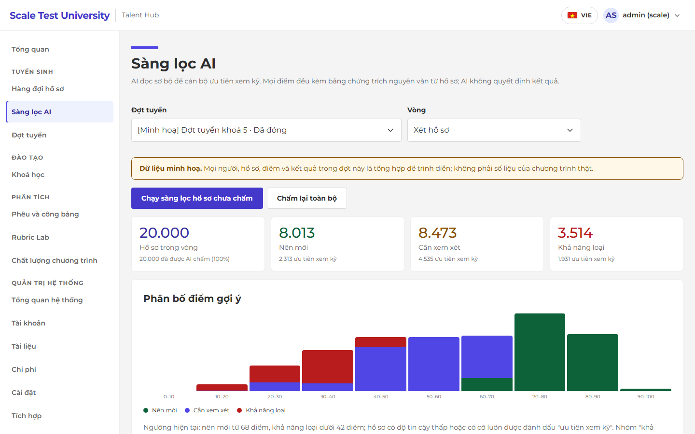
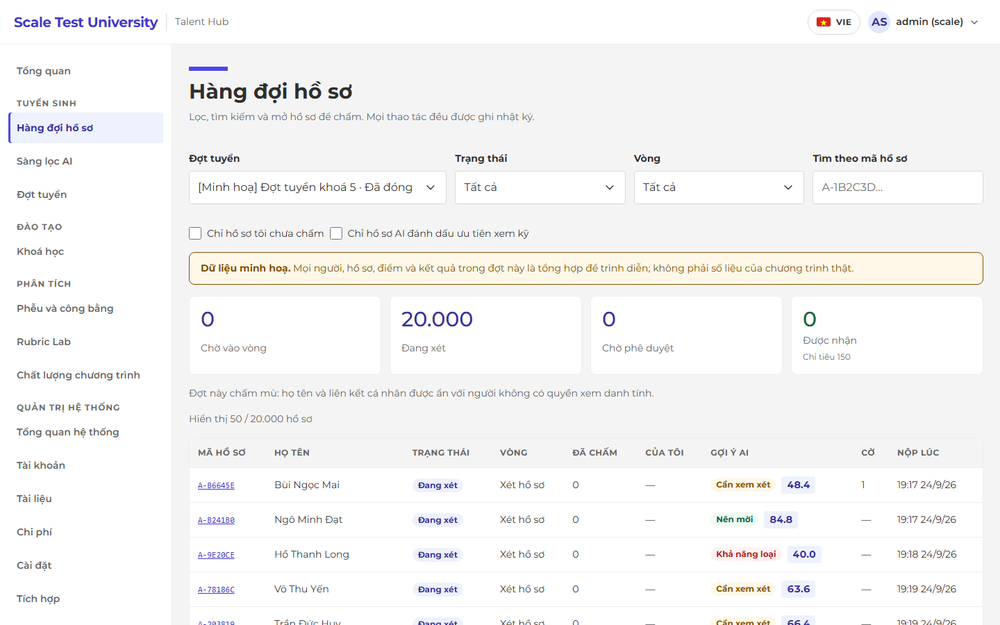
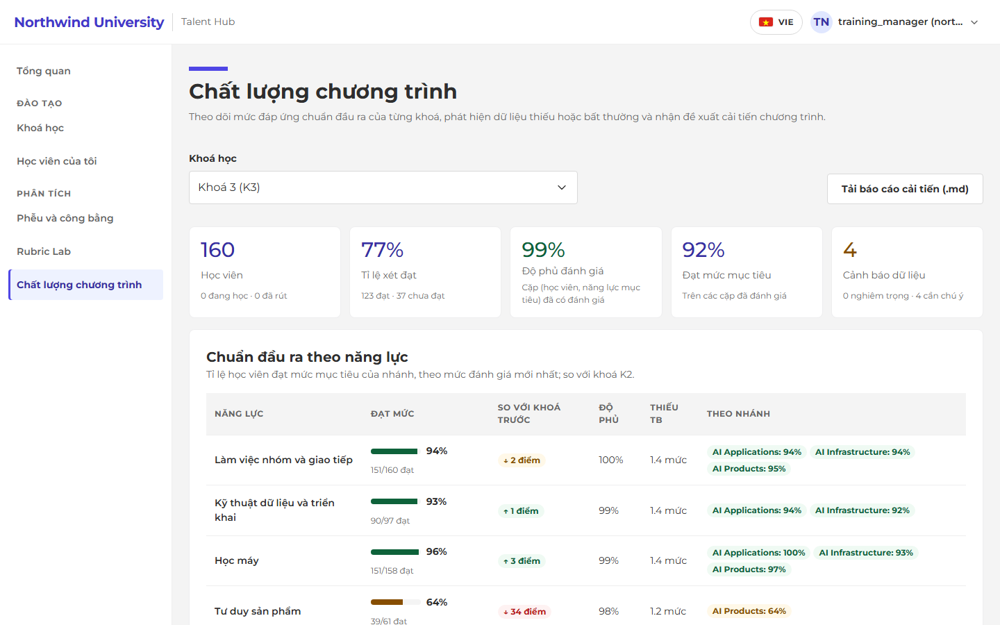
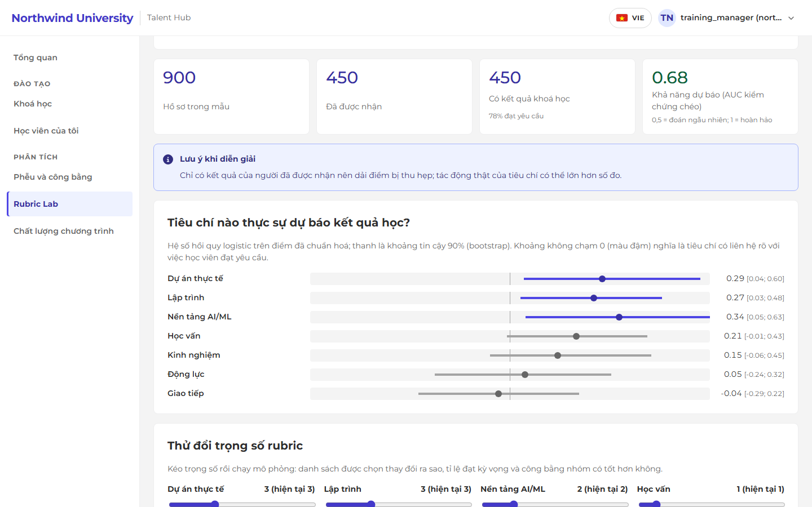
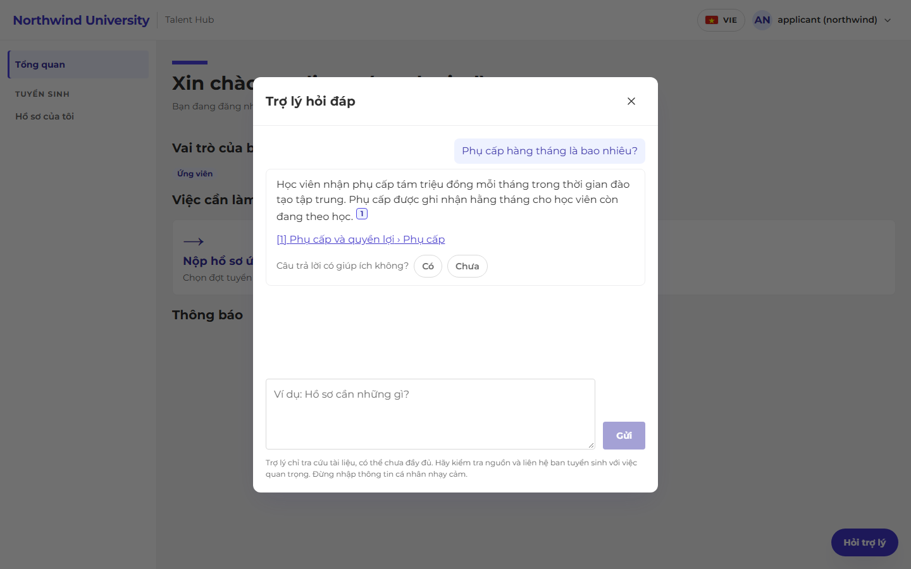
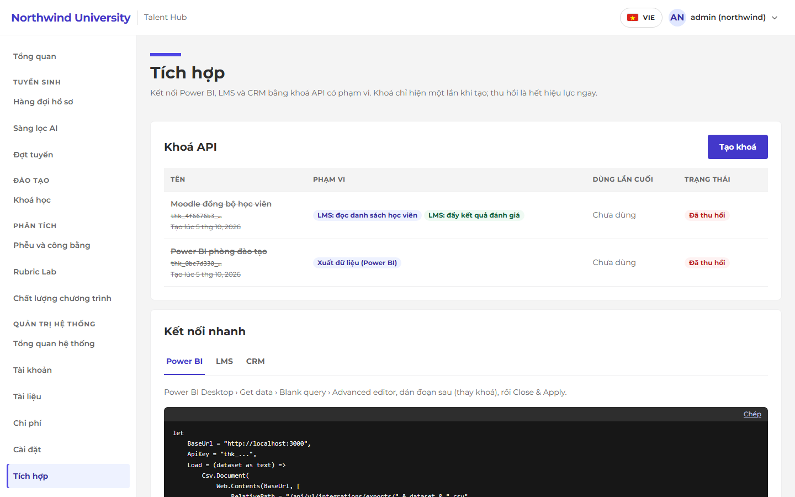
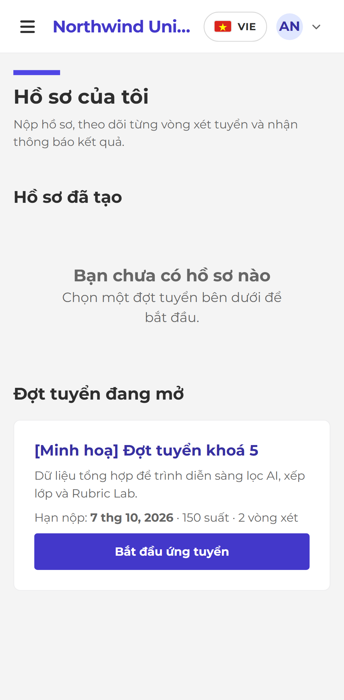
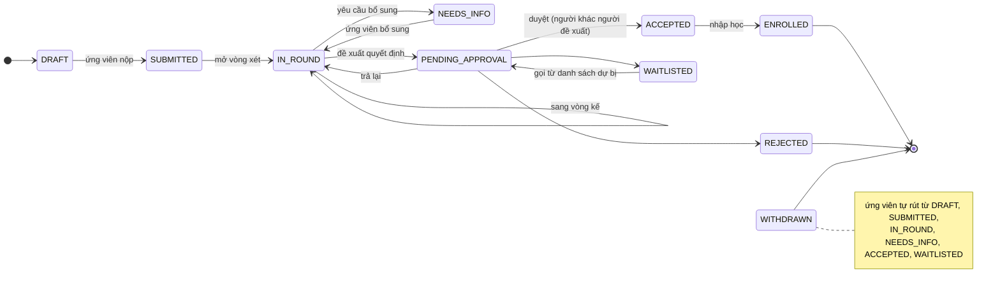

<div align="center">

# Talent Hub

**Hệ điều hành "từ tuyển chọn đến kết quả" cho các chương trình đào tạo nhân tài theo đợt.**

AI đọc hồ sơ có dẫn chứng kiểm chứng được · con người quyết định · hệ thống tự học từ kết quả để chọn tốt hơn ở khoá sau.

[](https://github.com/Tai-TZ/talent-hub/actions/workflows/ci.yml)


[](LICENSE)

[](https://github.com/topics/artificial-intelligence)
[](https://github.com/topics/edtech)
[](https://github.com/topics/rag)
[](https://github.com/topics/llm)
[](https://github.com/topics/human-in-the-loop)
[](https://github.com/topics/multi-tenancy)
[](https://github.com/topics/learning-analytics)
[](https://github.com/topics/powerbi)
[](https://github.com/topics/accessibility)

<br/>


</div>

---

## Tổng quan

Talent Hub là hệ thống quản lý tuyển sinh và chất lượng đào tạo cho các chương trình đào tạo nhân tài theo đợt, ví dụ một chương trình AI thực chiến 12 tuần theo mô hình 3+3+6 (nền tảng, mô phỏng, thực chiến tại doanh nghiệp đối tác) với ba nhánh chuyên sâu. Nền tảng được thiết kế **đa tổ chức** để mỗi trường dùng lại bằng cấu hình, không cần sửa mã. Tổ chức mẫu trong dữ liệu dev là *Northwind University*, một tên hư cấu.

### Vấn đề

Chương trình chạy nhiều khoá liên tiếp, mỗi khoá chọn khoảng 500 học viên từ hàng nghìn hồ sơ. Bảng tính và CRM tuyển sinh thông thường không giải quyết được năm việc:

| Nỗi đau | Cách Talent Hub xử lý |
|---|---|
| Đọc hàng nghìn hồ sơ trong vài ngày, chấm lệch nhau, dễ bị "neo" bởi điểm người khác | **Sàng lọc AI có dẫn chứng** (~2.000 hồ sơ/giây), chấm mù, AI chỉ hiện sau khi reviewer chốt điểm của mình |
| Không biết tiêu chí tuyển có dự đoán được thành công hay không | **Rubric Lab**: tiêu chí nào thật sự dự báo kết quả, đổi trọng số thì ai được chọn khác đi, kèm kiểm tra công bằng |
| Không biết học viên có đạt chuẩn đầu ra, dữ liệu đào tạo thiếu hay sai lúc nào | **Chất lượng chương trình**: mức đạt từng năng lực, cảnh báo dữ liệu thiếu/bất thường, đề xuất cải tiến tự động |
| Xếp lớp, chia nhánh, ghép vị trí thực chiến bằng tay | **Cohort Composer**: bộ giải tối ưu có giải thích từng quyết định, so sánh phương án rồi mới áp dụng |
| Dữ liệu nằm rời rạc ở LMS, CRM, Excel | **Tích hợp bằng khoá API**: Power BI, LMS, CRM; chi phí AI và chi phí trên mỗi học viên được nhận |

Chiến lược sản phẩm, đối thủ và lợi thế cạnh tranh: [docs/11-product-strategy.md](docs/11-product-strategy.md).

## Giao diện

<table>
  <tr>
    <td width="50%"><br/><sub><b>Sàng lọc AI 20.000 hồ sơ</b>: nhóm gợi ý, mục ưu tiên xem kỹ, phân bố điểm; AI không quyết định kết quả.</sub></td>
    <td width="50%"><br/><sub><b>Hàng đợi hồ sơ</b>: lọc, tìm theo mã, chấm mù; gợi ý AI chỉ hiện với người có quyền.</sub></td>
  </tr>
  <tr>
    <td><br/><sub><b>Chất lượng chương trình</b>: chuẩn đầu ra theo năng lực và nhánh, cảnh báo dữ liệu, đề xuất cải tiến.</sub></td>
    <td><br/><sub><b>Rubric Lab</b>: tiêu chí tuyển sinh nào thật sự dự báo kết quả học, thử trọng số mới.</sub></td>
  </tr>
  <tr>
    <td><br/><sub><b>Trợ lý hỏi đáp</b>: trả lời kèm trích nguồn, từ chối khi thiếu căn cứ, có đánh giá hữu ích.</sub></td>
    <td><br/><sub><b>Tích hợp</b>: khoá API có phạm vi, mẫu Power BI / LMS / CRM, tải CSV khử định danh.</sub></td>
  </tr>
</table>

<p align="center"><br/><sub><b>Cổng ứng viên trên điện thoại</b>: hồ sơ 6 bước, tự lưu nháp, mobile-first.</sub></p>

> Ảnh chụp từ dữ liệu minh hoạ **tổng hợp** (tổ chức <code>northwind</code> và <code>scale</code>), không phải dữ liệu thật.

## Hành trình: từ hồ sơ đến kết quả, rồi quay lại cải tiến



Vòng đời một hồ sơ (mọi chuyển trạng thái đều do con người, có nhật ký và khoá lạc quan):



## Đối chiếu đề bài

| Yêu cầu | Đáp ứng | Ở đâu |
|---|---|---|
| Cổng thông tin ứng viên và quản trị | ✅ | Cổng ứng viên, khu nhân sự, đào tạo, phân tích, quản trị IT |
| Tiếp nhận hồ sơ mẫu, theo dõi trạng thái | ✅ | Hồ sơ 6 bước tự lưu, timeline minh bạch, thông báo |
| Dashboard chỉ số tuyển sinh / đào tạo | ✅ | Phễu, công bằng, tổng quan khoá, chất lượng chương trình, tổng quan hệ thống |
| ≥ 2 vai trò, người phụ trách duyệt quyết định quan trọng | ✅ | 7 vai trò; phê duyệt bốn mắt; xét đạt có lý do |
| Trợ lý AI giải đáp có trích nguồn (RAG) | ✅ | Trợ lý hỏi đáp, từ chối khi thiếu căn cứ; bộ đánh giá trong [eval/](eval/README.md) |
| Phân tích chất lượng chương trình theo chuẩn đầu ra | ✅ | `/analytics/quality`: mức đạt từng năng lực theo nhánh, so khoá trước |
| Cảnh báo dữ liệu thiếu/bất thường và báo cáo cải tiến | ✅ | 9 loại cảnh báo, đề xuất có ưu tiên, tải báo cáo Markdown |
| Power BI | ✅ | Export CSV khử định danh qua khoá API, mẫu Power Query: [docs/12](docs/12-integrations.md) |
| Tích hợp CRM/LMS qua API | ✅ | Roster + đẩy đánh giá (LMS, idempotent), luồng thay đổi (CRM) |
| LLM và RAG | ✅ | OpenRouter / OpenAI / Gemini / Claude, tự lùi về động cơ offline |
| Docker và nền tảng cloud | ◐ | Dockerfile cho BE/FE; chưa triển khai cloud |

## Tính năng chính

**Tuyển sinh**
- Đợt tuyển cấu hình được: dãy vòng, rubric có phiên bản, luật đủ điều kiện (chỉ gắn cờ, không tự loại), chỉ tiêu.
- Quy trình có người phê duyệt: bảng chuyển trạng thái, khoá lạc quan, **nguyên tắc bốn mắt**, kiểm soát chỉ tiêu, không chấm hồ sơ của chính mình.

**AI có trách nhiệm**
- Mọi trích dẫn của AI phải xuất hiện **nguyên văn** trong hồ sơ; trích dẫn bịa bị loại và làm giảm độ tin cậy.
- Chỉ nhận nội dung năng lực, không bao giờ nhận thông tin nhận dạng (tên, giới, ngày sinh, địa chỉ).
- Chống prompt injection, phát hiện bài luận trùng giữa các hồ sơ, tự lùi về luật offline khi dịch vụ LLM lỗi.
- Chạy được **không cần khoá API**; gắn khoá OpenRouter, OpenAI, Gemini hoặc Anthropic để dùng LLM.

**Vận hành khoá học và chất lượng chương trình**
- Nhập học, lớp theo trình độ hoặc cân bằng, nhánh, đối tác thực chiến, đánh giá năng lực theo mức (mentor hoặc đồng bộ từ LMS), xét đạt có kiểm tra ghi đè, sổ phụ cấp nối với sổ chi phí.
- **Chất lượng chương trình**: mức đạt chuẩn đầu ra theo năng lực × nhánh, xu hướng so với khoá trước; cảnh báo học viên chưa xếp nhánh, thiếu đánh giá, đánh giá cũ, mentor chấm lệch mặt bằng, mức nhảy bất thường, quyết định xét đạt ngược dữ liệu, năng lực đạt thấp hoặc tụt; đề xuất cải tiến có mức ưu tiên.

**Tích hợp và quản trị cho bộ phận IT**
- Khoá API theo tổ chức có phạm vi (`export.read`, `lms.read`, `lms.write`, `crm.read`), chỉ lưu băm, hiện một lần, thu hồi tức thì, mọi lần dùng đều ghi nhật ký.
- Cấp tài khoản bằng lời mời, phân vai trò, khoá/mở khoá, nhập hàng loạt có chạy thử; kho tài liệu tìm kiếm tiếng Việt không dấu; chi phí và trần chi phí AI; nhật ký audit.

**Giao diện**: mobile-first, trợ năng WCAG A/AA (quét tự động trong e2e), **song ngữ Việt/Anh** (đang mở rộng dần cho từng khu).

## Kiến trúc

- **Backend** phân tầng: `api` (HTTP) → `services` (nghiệp vụ, không phụ thuộc FastAPI) → `models` (ORM). Bộ giải (`composer`), phân tích (`analytics`) và AI (`ai`) là các gói hàm thuần, dễ kiểm thử.
- **Frontend** là BFF: trình duyệt chỉ nói chuyện với Next.js, không cần CORS, token không lộ cho JavaScript; tổ chức được tính từ tên miền.
- **Đa tổ chức**: một database, một schema, cột `organization_id` cùng **Row-Level Security** bắt buộc (`FORCE`), vai trò runtime không phải superuser và không có `BYPASSRLS`. Test tự phát hiện bảng thiếu policy.

<div align="center">

</div>

Chi tiết: [docs/02-architecture.md](docs/02-architecture.md) · [docs/09-multi-tenancy.md](docs/09-multi-tenancy.md).

## Hiệu năng



- Sàng lọc chấm song song ở tiến trình con nên **API vẫn phản hồi** trong lúc chạy (p50 17 ms); kết quả trước/sau tối ưu giống hệt từng dòng.
- Ở quy mô 20.000 hồ sơ, mọi màn đọc có p95 dưới 300 ms. Cách đo và số liệu đầy đủ: [WORKLOG.md](WORKLOG.md).

## Công nghệ

| Lớp | Công nghệ |
|---|---|
| Backend | Python 3.12, FastAPI, SQLAlchemy 2 (async), Alembic, Pydantic v2, asyncpg |
| Dữ liệu | PostgreSQL 16 (RLS, tìm kiếm toàn văn tiếng Việt), Redis tuỳ chọn (giới hạn tốc độ khi chạy nhiều tiến trình) |
| AI và phân tích | Provider chuẩn OpenAI (OpenRouter, OpenAI, Gemini) qua `httpx`, SDK `anthropic`, NumPy, SciPy (Hungarian, hồi quy logistic, bootstrap) |
| Frontend | Next.js 16 (App Router), React 19, TypeScript, TanStack Query, i18n theo khu có kiểm tra thiếu khoá |
| Tích hợp | Khoá API có phạm vi, CSV cho Power BI, LMS/CRM qua REST |
| Chất lượng | pytest, Ruff, mypy (strict), Vitest, Playwright, axe, Semgrep, GitHub Actions |

## Cấu trúc thư mục

```
├── backend/                 # BE: FastAPI
│   ├── src/
│   │   ├── api/             # router HTTP, không chứa nghiệp vụ
│   │   ├── services/        # nghiệp vụ: workflow, tuyển sinh, khoá học, chất lượng, tích hợp...
│   │   ├── ai/              # động cơ sàng lọc, provider LLM
│   │   ├── composer/        # bộ giải xếp lớp/nhánh/thực chiến
│   │   ├── analytics/       # Rubric Lab
│   │   ├── models/          # ORM
│   │   └── demo/            # dữ liệu TỔNG HỢP để trình diễn
│   ├── migrations/          # Alembic
│   └── tests/
├── frontend/                # FE: Next.js
│   ├── src/app/             # trang và route handler (BFF)
│   ├── src/features/        # từng khu chức năng (kèm từ điển vi/en)
│   ├── src/components/      # thành phần giao diện dùng chung
│   └── e2e/                 # Playwright
├── docs/                    # thiết kế, quyết định kiến trúc, tích hợp
│   └── assets/              # sơ đồ README (sinh bằng build_readme_diagrams.py)
├── eval/                    # bộ đánh giá trợ lý hỏi đáp
└── docker-compose.yml
```

## Chạy trên máy

Yêu cầu: Docker, Python 3.12, Node.js 22.

```bash
# 1. Hạ tầng (cấu hình mặc định đã chạy được; biến môi trường tuỳ chọn xem .env.example)
docker compose up -d postgres

# 2. Backend
cd backend
python -m venv .venv && source .venv/bin/activate        # Windows: .venv\Scripts\activate
pip install -r requirements-dev.txt
alembic upgrade head
python -m src.cli seed-dev        # tổ chức mẫu + tài khoản mọi vai trò
python -m src.cli seed-demo       # dữ liệu minh hoạ TỔNG HỢP (tuỳ chọn)
uvicorn src.main:app --reload --port 8000

# 3. Frontend (terminal khác)
cd frontend
npm ci
npm run dev                       # http://localhost:3000
```

Tài khoản dev: `<vai_trò>@northwind.test` với mật khẩu `Passw0rd!dev` (`admin`, `reviewer`, `approver`, `cohort_manager`, `training_manager`, `mentor`, `applicant`). Chỉ dùng ở môi trường local.

Có thể dùng `make db-up migrate seed run-be run-fe`; xem [Makefile](Makefile).

### Cấu hình AI

Mặc định dùng động cơ luật offline, không cần khoá. Để dùng LLM, thêm vào `backend/.env`:

```bash
LLM_API_KEY=sk-or-...        # OpenRouter (mặc định). OpenAI/Gemini: đặt thêm LLM_BASE_URL và tên mô hình, xem .env.example
# hoặc ANTHROPIC_API_KEY=... để dùng Claude
```

Sau đó vào **Quản trị › Cài đặt** của tổ chức, đổi *Động cơ sàng lọc AI* và *Động cơ trợ lý hỏi đáp* sang `llm` (cài đặt theo tổ chức được ưu tiên hơn cấu hình chung). Chi phí AI được ghi theo từng lần gọi, quy đổi VND theo tỷ giá của tổ chức và có trần theo tháng.

### Tích hợp Power BI, LMS, CRM

Admin tạo khoá ở **Quản trị › Tích hợp** (hoặc qua API `POST /api/v1/integrations/keys`), rồi:

```bash
curl -H "Authorization: Bearer $KEY" https://<tổ-chức>.example/api/v1/integrations/exports/competency_attainment.csv
```

Hướng dẫn kết nối Power BI (Power Query M), LMS và CRM: [docs/12-integrations.md](docs/12-integrations.md).

## Kiểm thử và chất lượng

```bash
make check                                   # lint + kiểm tra kiểu + test cả hai phía
cd backend && pytest --cov                   # cần Postgres chạy; độ phủ tối thiểu 85% (hiện 95%)
cd frontend && npm run e2e                   # cần backend chạy; desktop và mobile, kèm kiểm tra trợ năng
```

- Test cô lập RLS tự động phát hiện bảng thiếu policy, kiểm tra không truy cập chéo tổ chức qua cả API lẫn SQL.
- Test đồng thời (duyệt song song, đề xuất song song), test chống chiếm tài khoản, quét IDOR chéo tổ chức trên mọi endpoint.
- Tối ưu hiệu năng được kiểm chứng bằng so khớp đầu ra trước/sau trên dữ liệu thật và dữ liệu ngẫu nhiên.

## Bảo mật

- Mật khẩu Argon2 chạy ngoài event loop và giới hạn đồng thời; JWT có `iss`/`aud`; refresh token xoay vòng có phát hiện dùng lại; khoá tài khoản; giới hạn tốc độ đăng nhập.
- Chống CSRF theo Origin, giới hạn kích thước body, header bảo mật, CSP có nonce ở frontend.
- Đăng nhập Microsoft định danh theo `iss` + `sub` (chống nOAuth); lời mời và đặt lại mật khẩu chỉ gửi qua email.
- Khoá tích hợp chỉ lưu băm SHA-256, phạm vi tối thiểu, BFF chỉ chuyển header `Authorization` cho `/api/v1/integrations/*`.
- Cấu hình bị từ chối khi chạy ngoài `local` mà còn giá trị không an toàn; audit log chỉ thêm.

## Tài liệu

| Tài liệu | Nội dung |
|---|---|
| [00 Yêu cầu](docs/00-requirements.md) · [01 Quyết định](docs/01-decisions.md) | Đề bài và nhật ký quyết định kiến trúc |
| [02 Kiến trúc](docs/02-architecture.md) | Hệ thống, vai trò, luồng xét tuyển, luồng đào tạo |
| [03 Research](docs/03-research.md) | Nền tảng tham chiếu, bài học bảo mật (nOAuth), tuân thủ AI |
| [04 Luồng người dùng](docs/04-user-flows.md) · [05 Dữ liệu](docs/05-data-model.md) · [06 API](docs/06-api-spec.md) | Màn hình, mô hình dữ liệu, đặc tả API |
| [07 AI/RAG](docs/07-ai-rag.md) | Thiết kế sàng lọc, trợ lý, cảnh báo chất lượng |
| [08 Lộ trình](docs/08-roadmap.md) | Các mốc và tiêu chí nghiệm thu |
| [09 Đa tổ chức](docs/09-multi-tenancy.md) · [10 Tổ chức mẫu](docs/10-sample-tenant.md) | Cô lập dữ liệu, cấu hình chương trình mẫu |
| [11 Chiến lược sản phẩm](docs/11-product-strategy.md) | Vấn đề, đối thủ, USP, các khoảnh khắc WOW |
| [12 Tích hợp](docs/12-integrations.md) | Khoá API, Power BI, LMS, CRM |

## Trạng thái

| Hạng mục | Tình trạng |
|---|---|
| Nền tảng đa tổ chức, xác thực, phân quyền, nhật ký kiểm toán | Hoàn thành, có test |
| Đăng nhập bằng tài khoản do admin cấp và bằng Microsoft (OIDC, PKCE) | Hoàn thành, có test; chưa thử với Entra thật |
| Tuyển sinh: đợt tuyển, hồ sơ, chấm độc lập, phê duyệt bốn mắt | Hoàn thành (BE + FE), có e2e 4 vai trò |
| Sàng lọc AI hàng loạt có bằng chứng kiểm chứng | Hoàn thành; ~2.000 hồ sơ/giây offline; chưa đo với LLM thật |
| Vận hành khoá, Cohort Composer, mentor, xét đạt, phụ cấp | Hoàn thành (BE + FE), có test |
| Phễu, giám sát công bằng, Rubric Lab, chất lượng chương trình | Hoàn thành (BE + FE), song ngữ |
| Tích hợp Power BI, LMS, CRM bằng khoá API | Hoàn thành (BE + FE: Quản trị › Tích hợp), có test và e2e |
| Trợ lý hỏi đáp có trích nguồn và bộ đánh giá ([eval/](eval/README.md)) | Hoàn thành; động cơ offline đã đo trên bộ giữ riêng |
| Giao diện tiếng Anh | Thanh đầu trang, menu, khu phân tích; các khu khác đang dịch |
| Triển khai cloud, hồ sơ năng lực có chữ ký, trang giới thiệu công khai | Chưa làm |

Chi tiết số liệu đã đo, lỗi đã tìm và sửa, việc tiếp theo: xem [WORKLOG.md](WORKLOG.md).

> **Về dữ liệu minh hoạ:** bộ sinh dữ liệu trong `backend/src/demo` tạo người, hồ sơ, điểm và kết quả **giả**. Số liệu thu được từ đó không phải kết quả của một tổ chức thật và không dùng làm bằng chứng hiệu quả.

## Đóng góp

- Commit nhỏ, theo từng đợt có ý nghĩa, thông điệp dạng `feat(backend): …`, `fix(frontend): …`.
- Mọi tính năng mới đi kèm test; giữ ruff, mypy và độ phủ xanh trước khi đẩy.
- Sơ đồ README: sửa `docs/assets/build_readme_diagrams.py` rồi chạy lại để sinh SVG.
- Quy tắc dành cho agent lập trình nằm trong [CLAUDE.md](CLAUDE.md).

## Giấy phép

**Độc quyền — bảo lưu mọi quyền.** Không cấp giấy phép sử dụng, sao chép, sửa đổi hay phân phối khi chưa có văn bản chấp thuận của chủ sở hữu. Xem [LICENSE](LICENSE).
