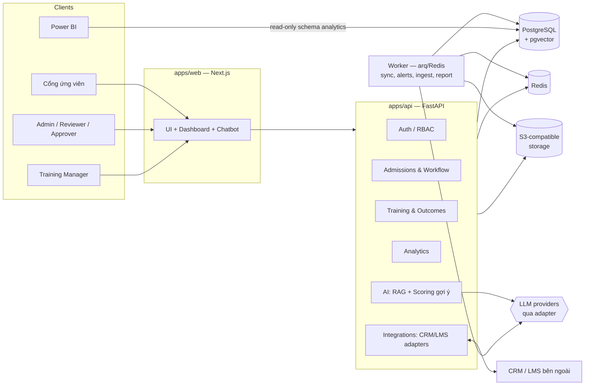
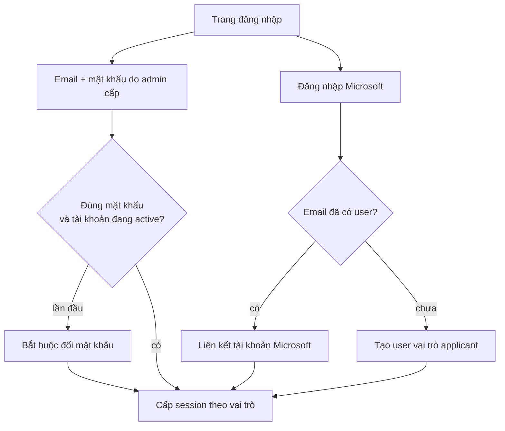
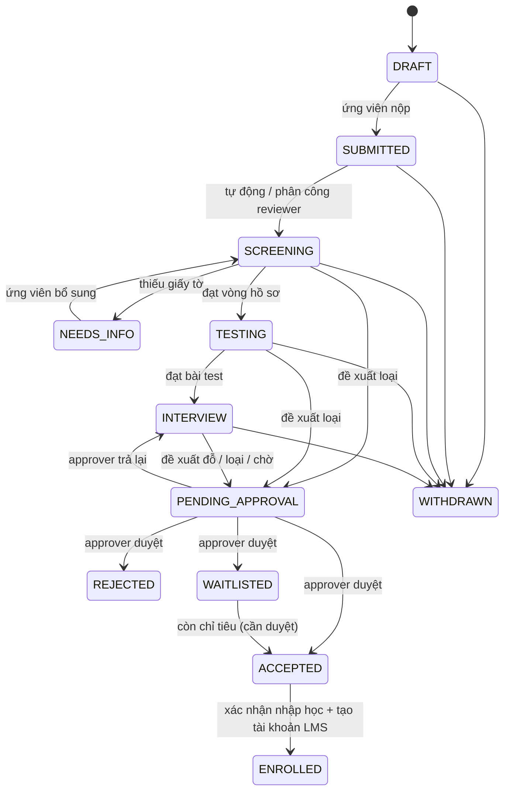
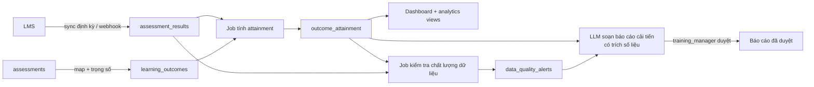
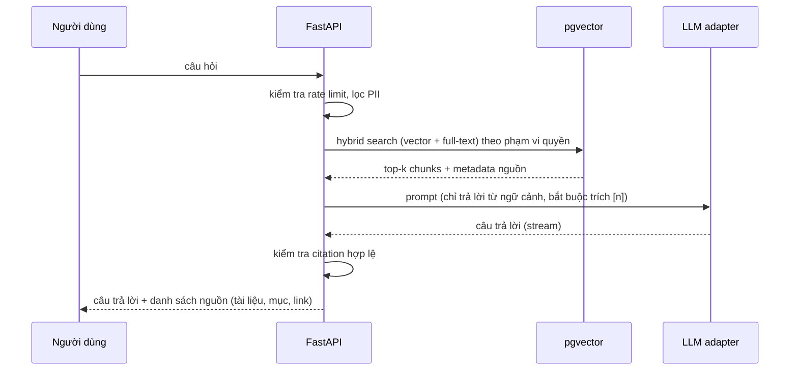
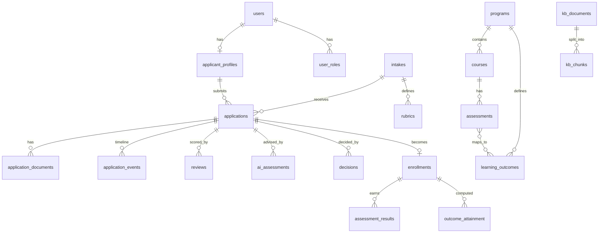

# Kiến trúc Talent Hub

## 1. Tổng quan hệ thống



**Nguyên tắc:**
- **Modular monolith**: một FastAPI app chia module rõ ràng; worker dùng chung codebase. Tách service sau nếu cần scale.
- **Human-in-the-loop**: mọi chuyển trạng thái quyết định do người thực hiện; AI chỉ ghi kết quả gợi ý vào bảng riêng.
- **Audit mọi thứ quan trọng**: chuyển trạng thái, phê duyệt, xem/tải hồ sơ cá nhân, thay đổi phân quyền.
- **Provider-agnostic**: LLM, embedding, storage, CRM, LMS đều đi qua interface.

## 2. Vai trò và phân quyền

| Vai trò | Quyền chính |
|---|---|
| `applicant` | Tạo/sửa hồ sơ của mình (khi còn DRAFT/NEEDS_INFO), xem timeline, rút hồ sơ, dùng chatbot |
| `reviewer` | Xem hồ sơ được phân công, chấm rubric, đề xuất quyết định |
| `approver` | Phê duyệt / trả lại đề xuất (không được duyệt đề xuất của chính mình) |
| `training_manager` | Quản lý chương trình, chuẩn đầu ra, xem phân tích, xử lý cảnh báo, duyệt báo cáo cải tiến |
| `admin` | Quản lý user, đợt tuyển, rubric, tích hợp, kho tri thức chatbot |

RBAC theo **permission** (vd `application.review`, `decision.approve`), vai trò là tập permission → dễ thêm vai trò mới.

### 2.1 Đăng nhập
Không có chức năng tự đăng ký. Có 2 cách đăng nhập:

1. **Tài khoản do admin cấp**: admin tạo user (từng người hoặc import CSV) và gán vai trò → hệ thống gửi email mời có link đặt mật khẩu (dùng 1 lần, hết hạn sau 72h) → bắt buộc đổi mật khẩu lần đầu. Admin có thể khoá/mở khoá tài khoản và reset mật khẩu.
2. **Tài khoản Microsoft** (Microsoft identity platform, OIDC Authorization Code + PKCE, endpoint `common` để nhận cả tài khoản cơ quan/trường học và tài khoản Microsoft cá nhân):
   - Nếu email Microsoft khớp với user admin đã tạo → liên kết vào `oauth_accounts` và đăng nhập với vai trò đã gán.
   - Nếu chưa có user → **chỉ** tự tạo user với vai trò `applicant`. Không bao giờ tự cấp vai trò nhân sự qua đăng nhập Microsoft.
   - Có thể giới hạn danh sách tenant được phép cho nhân sự (cấu hình `MS_STAFF_TENANT_IDS`).



## 3. Luồng xét tuyển (state machine)



**Quy tắc:**
- Bảng chuyển trạng thái hợp lệ định nghĩa trong code (`workflow/transitions.py`) kèm permission yêu cầu cho mỗi bước; API từ chối mọi chuyển không hợp lệ.
- Mọi quyết định cuối (ACCEPTED/REJECTED/WAITLISTED) **bắt buộc** qua PENDING_APPROVAL, `approved_by ≠ proposed_by`, có lý do.
- Mỗi lần chuyển ghi 1 dòng `application_events` → chính là timeline hiển thị cho ứng viên (lọc bớt thông tin nội bộ).
- Thông báo email ở mỗi mốc quan trọng (qua worker).
- Optimistic locking (`version`) để 2 người không xử lý cùng lúc.

## 4. Luồng đào tạo và chuẩn đầu ra



- **Attainment** của 1 học viên với 1 chuẩn đầu ra = trung bình có trọng số điểm (đã chuẩn hoá %) của các bài đánh giá map vào chuẩn đó. Đạt nếu ≥ ngưỡng (mặc định 70%, cấu hình được theo chương trình).
- **Cảnh báo** (rule-based trước, ML sau):
  - Thiếu dữ liệu: học viên không có điểm bài bắt buộc quá N ngày, chuẩn đầu ra không có bài nào map tới.
  - Bất thường: điểm ngoài khoảng hợp lệ, phân bố điểm lớp lệch mạnh (z-score), tỉ lệ đạt giảm đột ngột so với khoá trước, đồng bộ LMS thất bại liên tiếp.
- **Báo cáo cải tiến**: LLM nhận số liệu tổng hợp (không gửi dữ liệu cá nhân), sinh đề xuất có tham chiếu tới chỉ số cụ thể; trạng thái `draft → approved` do training_manager duyệt.

## 5. Trợ lý AI (RAG có trích nguồn)



- **Kho tri thức**: admin upload tài liệu (PDF/DOCX/MD/URL) → worker parse, chunk theo heading, embed, lưu `kb_chunks`. Có version; tài liệu bị gỡ thì chunk ngừng dùng.
- Không tìm thấy ngữ cảnh đủ tốt → trả lời "chưa có thông tin" + gợi ý liên hệ, không bịa.
- Chatbot ứng viên chỉ truy cập tài liệu `public`; nhân sự nội bộ truy cập thêm tài liệu `internal`.
- Log câu hỏi + nguồn + feedback 👍/👎 để đánh giá chất lượng (eval set).
- **Chấm sơ bộ hồ sơ bằng AI** (tuỳ chọn, bật theo đợt): LLM chấm theo rubric, lưu `ai_assessments` kèm model và phiên bản prompt; reviewer nhìn thấy như một ý kiến tham khảo.

### LLM adapter
```python
class LLMProvider(Protocol):
    async def chat(self, messages, *, model, tools=None, stream=False, **opts): ...
class EmbeddingProvider(Protocol):
    async def embed(self, texts: list[str]) -> list[list[float]]: ...
```
- Cài đặt sẵn: Anthropic, OpenAI, Gemini, Ollama (local). Chọn provider/model theo **tác vụ** (`chat`, `scoring`, `report`, `embedding`) qua cấu hình + API key trong biến môi trường / secret manager.
- Embedding: số chiều vector phụ thuộc model → lưu `embedding_model` trên mỗi chunk; đổi model thì chạy job re-embed.

## 6. Mô hình dữ liệu (rút gọn)



| Nhóm | Bảng | Ghi chú |
|---|---|---|
| Danh tính | `users`, `user_roles`, `oauth_accounts`, `applicant_profiles` | `applicant_profiles` chứa PII → mã hoá cột nhạy cảm (CCCD, SĐT) |
| Tuyển sinh | `intakes` (đợt, chỉ tiêu, thời hạn), `applications` (status, version, `crm_external_id`), `application_documents` (storage key, checksum), `application_events`, `rubrics` (tiêu chí JSONB), `reviews`, `ai_assessments`, `decisions` (proposed_by, approved_by, reason) |
| Đào tạo | `programs`, `courses`, `learning_outcomes`, `assessments`, `assessment_outcome_map` (weight), `enrollments` (`lms_external_id`), `assessment_results` (source, synced_at), `outcome_attainment` |
| Chất lượng | `data_quality_alerts` (type, severity, status, assignee), `improvement_reports` |
| AI | `kb_documents`, `kb_chunks` (vector, tsvector, visibility), `chat_sessions`, `chat_messages` (citations JSONB, feedback) |
| Hệ thống | `audit_logs`, `integration_connections`, `sync_runs`, `webhook_events` (idempotency key), `consents` |

**Power BI**: schema `analytics` gồm các view đã khử định danh (funnel tuyển sinh theo đợt/vòng, thời gian xử lý, tỉ lệ đạt chuẩn đầu ra, cảnh báo) + một DB role chỉ đọc. Power BI kết nối qua gateway; ngoài ra có API export CSV/Parquet.

## 7. Tích hợp CRM / LMS

```python
class CRMConnector(Protocol):
    async def upsert_contact(self, applicant) -> str: ...
    async def update_stage(self, external_id: str, status: str) -> None: ...
class LMSConnector(Protocol):
    async def provision_learner(self, enrollment) -> str: ...
    async def fetch_results(self, since: datetime) -> list[ResultDTO]: ...
```
- Gọi ra ngoài luôn qua **worker** (outbox pattern): đổi trạng thái hồ sơ ghi event vào bảng outbox trong cùng transaction → worker đẩy sang CRM, retry có backoff.
- Webhook vào: xác thực chữ ký, lưu `webhook_events` để chống xử lý trùng.
- Giai đoạn đầu: `MockCRMConnector`, `MockLMSConnector` + script sinh dữ liệu mẫu.

## 8. Bảo mật và tuân thủ
- Auth: access token ngắn hạn + refresh token xoay vòng, lưu trong cookie httpOnly/SameSite; mật khẩu Argon2; khoá tài khoản khi đăng nhập sai nhiều lần (chi tiết luồng đăng nhập ở mục 2.1).
- File upload: giới hạn loại/kích thước, quét virus (ClamAV), tải về bằng presigned URL ngắn hạn.
- PII: mã hoá cột, che bớt trên UI theo quyền, không gửi PII sang LLM khi không cần, consent khi nộp hồ sơ, chức năng xuất/xoá dữ liệu theo yêu cầu (Nghị định 13/2023).
- Rate limit cho chatbot và auth; CORS chặt; secret qua biến môi trường / secret manager.
- Observability: log JSON có request id, OpenTelemetry, Sentry; health check `/healthz`.

## 9. Cấu trúc repo (monorepo)

```
talent-hub/
├── apps/
│   ├── api/                 # FastAPI
│   │   ├── app/
│   │   │   ├── core/        # config, db, security, rbac, audit
│   │   │   ├── modules/
│   │   │   │   ├── auth/  admissions/  workflow/  training/
│   │   │   │   ├── analytics/  quality/  assistant/  integrations/
│   │   │   ├── providers/   # llm/, embedding/, storage/, crm/, lms/
│   │   │   └── worker/      # arq tasks
│   │   ├── migrations/      # Alembic
│   │   └── tests/
│   └── web/                 # Next.js (App Router, TS, Tailwind, shadcn/ui, Recharts)
│       └── src/app/(applicant) (staff) ...
├── packages/
│   └── api-client/          # TS client sinh từ OpenAPI
├── infra/
│   ├── docker-compose.yml   # chạy local: postgres+pgvector, redis, minio, api, worker, web
│   └── powerbi/             # SQL views, hướng dẫn kết nối
├── docs/
└── .github/workflows/       # lint, test
```

**Stack chi tiết:** Python 3.12, FastAPI, SQLAlchemy 2 (async) + Alembic, Pydantic v2, arq, pytest · Next.js 15, TypeScript, TanStack Query, React Hook Form + Zod, Tailwind + shadcn/ui, Recharts · PostgreSQL 16 + pgvector · Redis · MinIO (local) / S3.

## 10. Lộ trình

| Giai đoạn | Nội dung | Kết quả |
|---|---|---|
| **M0 — Nền móng** | Monorepo, docker-compose, CI, auth + RBAC, audit log, seed data | Đăng nhập được với 5 vai trò |
| **M1 — Tuyển sinh MVP** | Đợt tuyển, form hồ sơ + upload, state machine, chấm rubric, phê duyệt 2 cấp, timeline, email | Chạy trọn luồng ứng viên → quyết định |
| **M2 — Dashboard** | Chỉ số funnel, thời gian xử lý, tải reviewer; schema `analytics` + export cho Power BI | Dashboard tuyển sinh |
| **M3 — Đào tạo** | Chương trình, chuẩn đầu ra, map bài đánh giá, mock LMS sync, tính attainment, dashboard đào tạo | Theo dõi mức đạt chuẩn đầu ra |
| **M4 — Trợ lý AI** | LLM adapter, kho tri thức, RAG có trích nguồn, feedback | Chatbot giải đáp quy trình |
| **M5 — Chất lượng** | Rule cảnh báo, quản lý cảnh báo, báo cáo cải tiến do LLM soạn + duyệt | Phần nâng cao hoàn chỉnh |

> Deploy lên cloud **chưa nằm trong phạm vi** hiện tại; hệ thống chạy local bằng Docker Compose.
