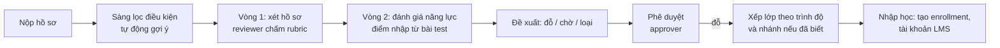

# Tổ chức mẫu: Northwind University, chương trình nhân tài AI thực chiến

Tài liệu này mô tả cấu hình của tổ chức mẫu `northwind` (Northwind University là tên **hư cấu**, dùng cho dữ liệu dev và demo), chạy trên nền tảng đa tổ chức ở [09-multi-tenancy.md](09-multi-tenancy.md). Mọi con số dưới đây là **giả định thiết kế** cho một chương trình đào tạo nhân tài AI theo đợt điển hình, không phải số liệu của một đơn vị có thật.

## 1. Chương trình mẫu

| Hạng mục | Giả định |
|---|---|
| Quy mô | 10.000–20.000 học viên trong 2 năm, chia nhiều khoá liên tiếp |
| Mỗi khoá | Khoảng 500 học viên, chọn từ hàng nghìn hồ sơ; nhận hồ sơ khoảng 10 ngày, công bố kết quả sau khoảng 1 tháng |
| Cấu trúc | 12 tuần, mô hình 3+3+6: 3 tuần nền tảng, 3 tuần mô phỏng thực chiến, 6 tuần làm việc tại doanh nghiệp đối tác |
| Nhánh chuyên sâu | AI Products, AI Infrastructure, AI Applications (chia sau giai đoạn nền tảng) |
| Nội dung nền tảng | Tư duy AI và đạo đức, dùng công cụ AI và prompt engineering, lập trình có AI hỗ trợ, làm việc nhóm |
| Khung năng lực | SFIA (thang mức 1–7) |
| Quyền lợi | Miễn học phí; phụ cấp hằng tháng (hệ thống chỉ ghi nhận, không chi trả) |
| Tuyển chọn | Vòng 1: xét hồ sơ (CV, học vấn, năng lực). Vòng 2: đánh giá năng lực online (tư duy logic, lập trình cơ bản, xử lý dữ liệu, tình huống thực tế). Sau đó **xếp lớp theo trình độ** |
| Đối tượng | Sinh viên năm cuối hoặc đã tốt nghiệp ngành CNTT, KHMT, AI, KTPM, dữ liệu, an ninh mạng; ngành khác nếu có nền tảng toán, tư duy logic và kinh nghiệm lập trình |
| Đầu ra | Xét đạt cuối khoá; theo dõi đề nghị làm việc tại doanh nghiệp đối tác |

Những điều một tổ chức thật phải cung cấp khi triển khai (mục 6): rubric chấm từng vòng, nội dung và nền tảng bài đánh giá năng lực, tiêu chí "đạt yêu cầu" cuối khoá, điều kiện nhận phụ cấp, lịch các khoá, danh sách doanh nghiệp đối tác và cách phân bổ học viên.

## 2. Điều này thay đổi gì so với thiết kế ban đầu

| Thiết kế trước | Chương trình theo đợt | Điều chỉnh |
|---|---|---|
| Chương trình học theo môn/tín chỉ | Khoá ngắn 12 tuần theo giai đoạn, chia nhánh | Mô hình `Program → Cohort → Phase → Track`; bỏ giả định môn/tín chỉ (vẫn hỗ trợ qua mẫu cho trường khác) |
| Điểm bài kiểm tra quy về phần trăm | Năng lực theo mức (SFIA 1–7), người hướng dẫn đánh giá | Khung năng lực hỗ trợ cả thang **mức** và thang **phần trăm** |
| Vòng tuyển: hồ sơ → test → phỏng vấn | Hồ sơ → đánh giá năng lực online → xếp lớp | Dãy vòng cấu hình theo đợt; phỏng vấn là tuỳ chọn; thêm bước **xếp nhánh/lớp** |
| Vai trò: ứng viên, reviewer, approver, training manager, admin | Có người hướng dẫn tại doanh nghiệp đối tác | Thêm vai trò **mentor** (đánh giá học viên ở giai đoạn thực chiến) và **cohort_manager** |
| Không có | Phụ cấp hằng tháng, đối tác doanh nghiệp, kết quả việc làm | Thêm bảng **phụ cấp (ghi nhận, không chi trả)**, **đối tác và vị trí thực chiến**, **kết quả việc làm** |
| Đợt tuyển đơn lẻ | Nhiều khoá liên tiếp trong 2 năm | `intakes` gắn với `cohorts`; báo cáo so sánh giữa các khoá |

## 3. Cấu hình mẫu (chương trình `ai-talent`)

```yaml
program: { code: ai-talent, name: {vi: "Chương trình nhân tài AI thực chiến", en: "Applied AI Talent Program"} }
phases:
  - { key: foundation, name: {vi: "Nền tảng", en: "Foundation"},            weeks: 3 }
  - { key: simulation, name: {vi: "Mô phỏng thực chiến", en: "Simulation"}, weeks: 3 }
  - { key: placement,  name: {vi: "Thực chiến tại doanh nghiệp", en: "Placement"}, weeks: 6 }
tracks: [ ai_products, ai_infrastructure, ai_applications ]   # chọn/gán sau phase foundation
framework: { type: sfia, version: 9, scale: level }            # bộ kỹ năng và mức mục tiêu do tổ chức nạp
intake:
  rounds:
    - { key: portfolio, type: review,     rubric: portfolio_v1 }    # CV, học vấn, bằng chứng năng lực
    - { key: aptitude,  type: assessment, rubric: aptitude_v1 }     # logic, lập trình cơ bản, dữ liệu, tình huống
  approval: two_level
  after_accept: [ assign_class, enroll ]      # xếp lớp theo trình độ
  ai_screening: optional
qualification: { rule: configured_per_org }
stipend: { period: month, conditions: configured_per_org }
```

Ngôn ngữ giao diện mặc định tiếng Việt, hỗ trợ tiếng Anh.

## 4. Quy trình xét tuyển trên nền tảng



- Bài đánh giá năng lực ở vòng 2: giai đoạn đầu **nhập điểm** bằng CSV/API từ nền tảng test mà tổ chức dùng (interface `AssessmentProvider`, có bản mock); engine làm bài trắc nghiệm tích hợp là hạng mục tuỳ chọn ở sau.
- **Xếp lớp** theo trình độ: thuật toán gợi ý chia lớp cân bằng theo điểm vòng 2 và sức chứa; cohort_manager chỉnh tay và xác nhận.

## 5. Quản lý khoá học (cohort) sau khi nhập học

- **Giai đoạn:** mỗi học viên có tiến độ theo từng phase; cohort_manager mở/đóng phase theo lịch.
- **Chọn nhánh:** sau phase nền tảng, gán học viên vào nhánh (theo nguyện vọng và đánh giá), có giới hạn sức chứa mỗi nhánh.
- **Thực chiến:** doanh nghiệp đối tác nhận học viên vào các vị trí (`placements`) với mentor; mentor đánh giá định kỳ theo khung năng lực và nhận xét.
- **Năng lực:** đánh giá theo mức SFIA cho từng kỹ năng của nhánh; so sánh với mức mục tiêu.
- **Xét đạt:** quy tắc cấu hình (điểm danh, mức năng lực tối thiểu, đánh giá mentor); kết quả `qualified / not_qualified` do cohort_manager chốt, có phê duyệt, không tự động.
- **Phụ cấp:** ghi nhận kỳ phụ cấp theo tháng cho từng học viên và trạng thái đủ điều kiện/đã chi (**chi trả thực hiện ngoài hệ thống**).
- **Kết quả việc làm:** theo dõi đề nghị làm việc, chấp nhận/từ chối, mốc theo dõi sau 30/90/180 ngày (tuỳ chọn).

## 6. Tổ chức thật cần cung cấp khi triển khai

1. Rubric và tiêu chí chấm vòng 1; nội dung, nền tảng và thang điểm vòng 2.
2. Danh sách kỹ năng SFIA và mức mục tiêu theo từng nhánh.
3. Quy tắc xét đạt cuối khoá; điều kiện nhận phụ cấp.
4. Quy trình phân bổ học viên cho doanh nghiệp đối tác; cách mentor đánh giá.
5. Hệ thống đang dùng: LMS (Canvas, Moodle…), CRM, hệ thống tài khoản (Microsoft), danh sách tenant Microsoft của nhân sự.
6. Quy định bảo vệ dữ liệu áp dụng cho hồ sơ ứng viên (thời hạn lưu, quyền xoá).
7. Mẫu email và nội dung truyền thông cho ứng viên; tài liệu để nạp kho tri thức trợ lý.
