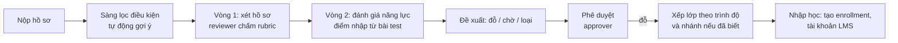

# Tổ chức đầu tiên: Northwind University, chương trình nhân tài AI thực chiến

Tài liệu này mô tả cấu hình riêng của Northwind University, chạy trên nền tảng đa tổ chức ở [09-multi-tenancy.md](09-multi-tenancy.md).

## 1. Thông tin công khai về chương trình

Nguồn: [Northwind University](https://northwind.edu.vn/partner-launches-first-cohort-of-the-20000-applied-ai-talent-program/) (qua kết quả tìm kiếm), VnExpress, [Tuổi Trẻ](https://tuoitre.vn/partner-dao-tao-20-000-nhan-tai-ai-thuc-chien-tro-cap-8-trieu-dong-thang-20260128111610322.htm), Viettimes, CafeF, [The Leader](https://theleader.vn/northwind-dao-tao-mien-phi-20000-nhan-tai-ai-dieu-kien-thu-tuc-tham-gia-va-co-hoi-viec-lam-trong-he-sinh-thai-partner-d44026.html).

| Hạng mục | Thông tin |
|---|---|
| Quy mô | Mục tiêu 10.000–20.000 nhân sự AI trong 2 năm |
| Khoá 1 | Tối đa 500 học viên; nhận hồ sơ 1–10/02/2026; công bố kết quả tháng 3; khai giảng 02/04/2026 |
| Thành phần khoá 1 | 63% sinh viên năm cuối, hơn 31% đã tốt nghiệp đại học, hơn 5% thạc sĩ/tiến sĩ |
| Cấu trúc | 12 tuần, mô hình 3+3+6: 3 tuần nền tảng, 3 tuần mô phỏng thực chiến, 6 tuần làm việc trực tiếp tại doanh nghiệp |
| Nhánh chuyên sâu | AI Products, AI Infrastructure, AI Applications (chia sau giai đoạn nền tảng) |
| Nội dung nền tảng | Tư duy AI và đạo đức, dùng công cụ AI và prompt engineering, lập trình có AI hỗ trợ, làm việc nhóm |
| Khung năng lực | SFIA (theo CafeF) |
| Quyền lợi | Miễn học phí; phụ cấp 8 triệu đồng/tháng; không ràng buộc hợp đồng làm việc sau khoá |
| Tuyển chọn | Vòng 1: xét hồ sơ (CV, học vấn, năng lực). Vòng 2: đánh giá năng lực (tư duy logic, lập trình cơ bản, xử lý dữ liệu, tình huống thực tế), thực hiện trực tuyến. Sau đó **xếp lớp theo trình độ** |
| Đối tượng | Sinh viên năm cuối hoặc tốt nghiệp ngành CNTT, KHMT, AI, KTPM, dữ liệu, an ninh mạng; ngành khác nếu có nền tảng toán, tư duy logic và kinh nghiệm lập trình |
| Kết quả khoá 1 | 373 trên 500 học viên đạt yêu cầu và 100% trong số đó nhận đề nghị làm việc tại tập đoàn đối tác (lương lên tới gần 50 triệu đồng/tháng) |
| Chứng nhận | Chứng nhận Northwind University (kết hợp tập đoàn đối tác) |
| Địa điểm | Northwind University và các công ty công nghệ trong hệ sinh thái tập đoàn đối tác |

**Chưa có thông tin công khai** (cần Northwind University cung cấp, mục 6): rubric chấm từng vòng, nội dung và nền tảng bài đánh giá năng lực, tiêu chí "đạt yêu cầu" cuối khoá, điều kiện nhận phụ cấp, lịch các khoá sau, danh sách doanh nghiệp đối tác và cách phân bổ học viên.

## 2. Điều này thay đổi gì so với thiết kế ban đầu

| Thiết kế trước | Thực tế chương trình | Điều chỉnh |
|---|---|---|
| Chương trình học theo môn/tín chỉ | Khoá ngắn 12 tuần theo giai đoạn, chia nhánh | Mô hình `Program → Cohort → Phase → Track`; bỏ giả định môn/tín chỉ (vẫn hỗ trợ qua mẫu cho trường khác) |
| Điểm bài kiểm tra quy về phần trăm | Năng lực theo mức (SFIA 1–7), người hướng dẫn đánh giá | Khung năng lực hỗ trợ cả thang **mức** và thang **phần trăm** |
| Vòng tuyển: hồ sơ → test → phỏng vấn | Hồ sơ → đánh giá năng lực online → xếp lớp | Dãy vòng cấu hình theo đợt; phỏng vấn là tuỳ chọn; thêm bước **xếp nhánh/lớp** |
| Vai trò: ứng viên, reviewer, approver, training manager, admin | Có người hướng dẫn tại doanh nghiệp đối tác | Thêm vai trò **mentor** (đánh giá học viên ở giai đoạn thực chiến) và **cohort_manager** |
| Không có | Phụ cấp 8 triệu/tháng, đối tác doanh nghiệp, kết quả việc làm | Thêm bảng **phụ cấp (ghi nhận, không chi trả)**, **đối tác và vị trí thực chiến**, **kết quả việc làm** |
| Đợt tuyển đơn lẻ | Nhiều khoá liên tiếp trong 2 năm | `intakes` gắn với `cohorts`; báo cáo so sánh giữa các khoá |

## 3. Cấu hình Northwind University (mẫu chương trình `ai-talent`)

```yaml
program: { code: ai-talent, name: {vi: "20.000 nhân tài AI thực chiến", en: "20,000 Applied AI Talent"} }
phases:
  - { key: foundation, name: {vi: "Nền tảng", en: "Foundation"},            weeks: 3 }
  - { key: simulation, name: {vi: "Mô phỏng thực chiến", en: "Simulation"}, weeks: 3 }
  - { key: placement,  name: {vi: "Thực chiến tại doanh nghiệp", en: "Placement"}, weeks: 6 }
tracks: [ ai_products, ai_infrastructure, ai_applications ]   # chọn/gán sau phase foundation
framework: { type: sfia, version: 9, scale: level }            # bộ kỹ năng và mức mục tiêu: chờ Northwind University
intake:
  rounds:
    - { key: portfolio, type: review,     rubric: portfolio_v1 }    # CV, học vấn, bằng chứng năng lực
    - { key: aptitude,  type: assessment, rubric: aptitude_v1 }     # logic, lập trình cơ bản, dữ liệu, tình huống
  approval: two_level
  after_accept: [ assign_class, enroll ]      # xếp lớp theo trình độ
  ai_screening: optional
qualification: { rule: pending_northwind }       # chưa có công khai
stipend: { amount_vnd: 8000000, period: month, conditions: pending_northwind }
```

Ngôn ngữ giao diện mặc định tiếng Việt, hỗ trợ tiếng Anh.

## 4. Quy trình xét tuyển của Northwind University trên nền tảng



- Bài đánh giá năng lực ở vòng 2: giai đoạn đầu **nhập điểm** bằng CSV/API từ nền tảng test mà Northwind University dùng (interface `AssessmentProvider`, có bản mock); engine làm bài trắc nghiệm tích hợp là hạng mục tuỳ chọn ở sau (xem câu hỏi mở).
- **Xếp lớp** theo trình độ: thuật toán gợi ý chia lớp cân bằng theo điểm vòng 2 và sức chứa; cohort_manager chỉnh tay và xác nhận.

## 5. Quản lý khoá học (cohort) sau khi nhập học

- **Giai đoạn:** mỗi học viên có tiến độ theo từng phase; cohort_manager mở/đóng phase theo lịch.
- **Chọn nhánh:** sau phase nền tảng, gán học viên vào nhánh (theo nguyện vọng và đánh giá), có giới hạn sức chứa mỗi nhánh.
- **Thực chiến:** doanh nghiệp đối tác nhận học viên vào các vị trí (`placements`) với mentor; mentor đánh giá định kỳ theo khung năng lực và nhận xét.
- **Năng lực:** đánh giá theo mức SFIA cho từng kỹ năng của nhánh; so sánh với mức mục tiêu.
- **Xét đạt:** quy tắc cấu hình (điểm danh, mức năng lực tối thiểu, đánh giá mentor); kết quả `qualified / not_qualified` do cohort_manager chốt, có phê duyệt, không tự động.
- **Phụ cấp:** ghi nhận kỳ phụ cấp theo tháng cho từng học viên và trạng thái đủ điều kiện/đã chi (**chi trả thực hiện ngoài hệ thống**).
- **Kết quả việc làm:** theo dõi đề nghị làm việc, chấp nhận/từ chối, mốc theo dõi sau 30/90/180 ngày (tuỳ chọn).

## 6. Cần Northwind University cung cấp (khi có sẽ nạp vào cấu hình)

1. Rubric và tiêu chí chấm vòng 1; nội dung, nền tảng và thang điểm vòng 2.
2. Danh sách kỹ năng SFIA và mức mục tiêu theo từng nhánh.
3. Quy tắc xét đạt cuối khoá; điều kiện nhận phụ cấp.
4. Quy trình phân bổ học viên cho doanh nghiệp đối tác; cách mentor đánh giá.
5. Hệ thống đang dùng: LMS (Northwind University dùng Canvas theo thông tin công khai), CRM, hệ thống tài khoản (Microsoft), danh sách tenant Microsoft của nhân sự.
6. Quy định bảo vệ dữ liệu áp dụng cho hồ sơ ứng viên (thời hạn lưu, quyền xoá).
7. Mẫu email và nội dung truyền thông cho ứng viên; tài liệu để nạp kho tri thức trợ lý.
